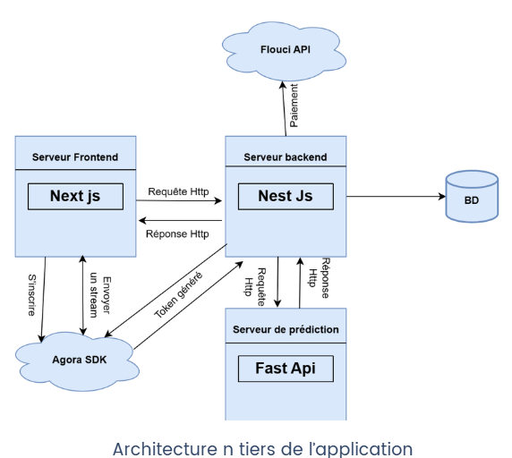

# 🐾 VetWise : Plateforme de Rendez-vous Vétérinaire

## Overview
VetWise is a web platform that streamlines veterinary appointment management for both pet owners and veterinarians. It centralizes scheduling, consultations, medical history, and online payments in one intuitive interface.

---

## Team
- Ali Wala
- Ayadi Takoua
- Frija Farah
- Issaoui Salma
- Zarrouki Rima

**Academic Supervisor:** Mme Hajer TAKTAK — INSAT, Université de Carthage

---

## Objectives
- Reduce appointment wait times and administrative overhead
- Centralize veterinarian-client communications
- Enable online and in-person consultations
- Provide structured medical history tracking per animal
- Integrate AI-based species and breed prediction from pet photos

---

## Features

### 🔐 Authentication (Sprint 1)
- Sign up / Sign in
- Email verification
- Password reset
- Two-factor authentication (2FA)
- User profile management

### 🐶 Pet Management (Sprint 1)
- Add and consult pet profiles
- AI-assisted species and breed detection from photo upload

### 📅 Appointments & Consultations (Sprint 2)
- Veterinarian availability management (by weekday or specific date)
- Appointment booking for one or multiple pets
- Manual confirmation by the veterinarian
- Daily schedule view
- Consultation history

### 📹 Online Consultations & Payments (Sprint 3)
- Real-time video consultations via **Agora SDK**
- In-app messaging between owners and veterinarians
- Online payment via **Flouci API**

---

## Tech Stack

| Layer | Technology |
|---|---|
| Frontend | Next.js, React |
| Backend | NestJS |
| Prediction Server | FastAPI |
| Database | PostgreSQL |
| Video | Agora SDK |
| Payment | Flouci API |

---

## Architecture
The application follows an **n-tier architecture**:
- Next.js frontend communicates with NestJS backend via HTTP
- NestJS connects to the database and the FastAPI prediction server
- Agora SDK handles real-time video streams
- Flouci API handles payment processing



---

## AI Module: Species & Breed Prediction

The prediction feature classifies pet images into **28 animal species** using a CNN trained on a custom dataset assembled from multiple Kaggle sources, including dogs, cats, cows, birds, and more.

### Dataset
- Collected and merged from multiple Kaggle datasets (dogs, cats, cows, birds, and other species)
- Covers **28 animal species classes**

### Model Architecture
- **Base:** VGG16 pretrained on ImageNet (top layers removed)
- **Custom head:** Dense layer with batch normalization + ReLU, followed by a Softmax output layer for multi-class classification
- **Framework:** Python · TensorFlow · Keras

### Training
- Optimizer: Adam (lr=1e-4)
- Loss: Categorical cross-entropy
- Metric: Accuracy
- Batch size: 32
- 10 initial epochs + additional fine-tuning

### Data Augmentation
- Random rotations, width/height shifts, shearing, zoom, horizontal flip, pixel rescaling

### Result
**Accuracy = 96.19%**

---

## Getting Started

### Prerequisites
- Node.js >= 16
- npm or yarn

### Installation & Running

#### Chat Service (port 3002)
```bash
cd chat
npm install
npm start
```

> Runs on [http://localhost:3002](http://localhost:3002)

---

## Non-Functional Requirements
- **Performance** — fast response times across all interactions
- **Security** — JWT tokens, 2FA, email verification
- **Usability** — intuitive interface for both user types
- **Maintainability** — modular, well-structured codebase

---

## Future Improvements
- Optimize the breed prediction model with continuous learning from user photos
- Auto-generate PDF prescriptions during consultations
- Veterinarian analytics dashboard (consultation frequency, revenue, patient count)
